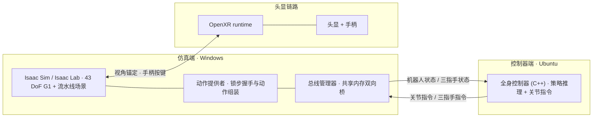
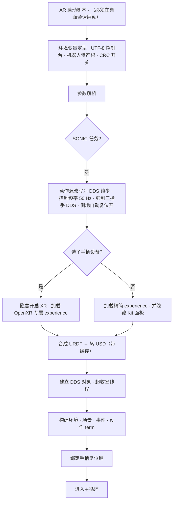
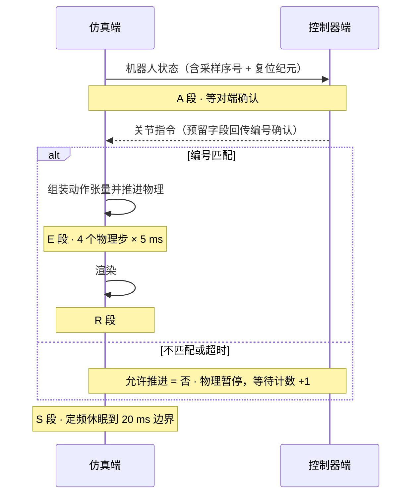
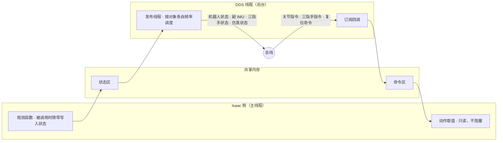
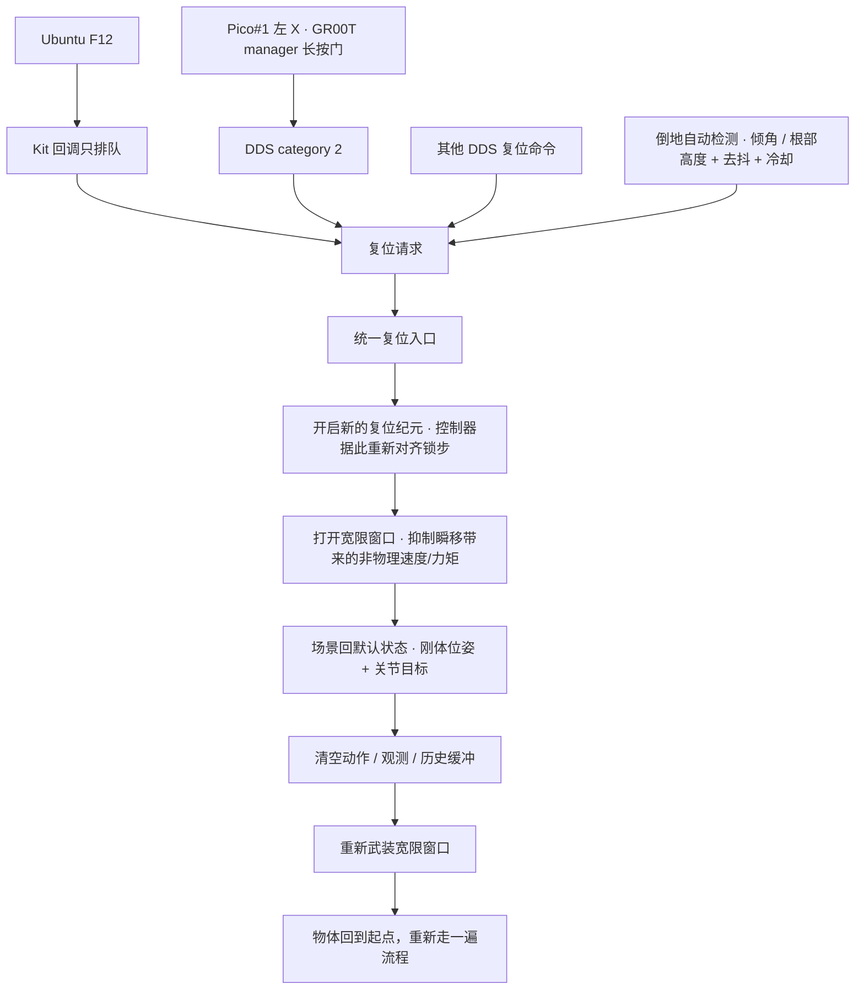
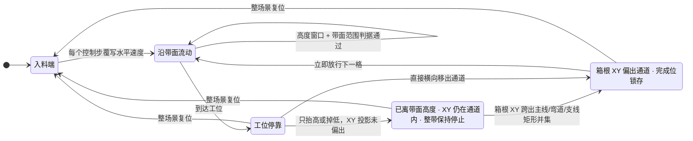

# AR 跨机仿真闭环 · 运行时架构

> 覆盖范围：`Isaac-G1-29DoF-Sonic-Conveyor` + AR 头显 + 跨机 DDS 锁步这一条链路。
> 非 AR 形态、数据回放、双机场景同步不在本文范围内（代码里都有，只是这条线上没走）。
>
> 同内容有两份呈现，改一份记得同步另一份：
> - **本文**（仓库版）：图用 mermaid 代码块，GitHub / VS Code / Obsidian 都能直接渲染。
> - **发布页**：https://claude.ai/code/artifact/ae879955-a8a0-4b5d-b901-824ad67222af
>   图改成了手写 HTML/CSS ——发布运行时**没有渲染 mermaid**（围栏原样显示成代码块，
>   含 `<--` 的那张还被消毒器整块吃掉），所以那边不能用 mermaid。

---

## 1. 系统构成

仿真端跑在 Windows，全身控制器跑在 Ubuntu，两端走**和真机完全相同的 DDS 话题**——
这是整套设计的前提：控制器不知道对面是仿真还是实物，同一份二进制既能驱动仿真也能驱动真机。

**三个关键约定**

| 约定 | 内容 |
|---|---|
| 机器人本体 | 29 个本体关节 + 双手各 7 个三指手关节（拇指 3 + 食指 2 + 中指 2）= 43 DoF；URDF 在启动时由**与策略训练同源的机器人描述资产**在本地合成（见下方说明） |
| 关节顺序 | DDS 侧的硬件顺序与仿真内部的关节顺序**不同**，全部映射按关节名建索引，不按下标 |
| 头显职责 | OpenXR **只接管视角与按键**，机器人关节指令 100% 来自 DDS——手柄不驱动机器人 |

**关于「合成」**：仿真里这台 43 DoF 机器人不是仓库里存着的模型文件，而是每次启动（模块导入期）
从本地一份机器人描述资产现拼出来的——本体的碰撞几何与力矩/速度限幅**原样取自策略训练用的那份
URDF**，可动的 14 个手指关节取自带手的关节模型，视觉网格另有来源，手部碰撞换成低复杂度的盒与胶囊。
合成时会逐关节比对拓扑与坐标、逐 link 比对惯量，对不上直接报错。

这么做是因为**动力学必须和训练时逐位一致**（否则策略在仿真里的表现与训练/真机对不上），
而训练那份 URDF 又没有可动手指。手工改一份存进仓库会在源资产更新后悄悄漂移，
合成加校验则会当场失败。

> ⚠️ 全程是**本地文件操作**，与跨机链路无关——不要读成「运行时从控制器那台机器拉取」。

---

## 2. 启动链路

启动脚本封装了几个「不设就起不来」的环境变量，之后程序会**按任务名自动改写参数**——
排查行为异常时先看启动日志里实际生效的值，不要假设命令行写的就是最终值。

> ⚠️ **XR 是另一条渲染链路**。它加载专属 experience，帧节奏由头显合成器决定，
> 下一节的帧预算账本**不适用于 AR**。

---

## 3. 锁步与帧预算

主循环单线程（Isaac 渲染要求），每圈 20 ms。仿真**不会自己往前跑**——
它在状态包里带上递增序号与复位纪元，必须等到控制器把同一组编号回传确认，才允许推进物理。

**为什么要锁步**：不锁步的话，控制器一旦推理变慢，仿真会带着**过期的动作**继续推进物理，
两端的时间轴悄悄错开。宁可暂停物理，也不让状态与指令失配——这是「仿真结果可复现」的底线。

### 实测帧预算

| 部署形态 | A 等确认 | E 物理 | R 渲染 | 余量 | 主循环 |
|---|---|---|---|---|---|
| 跨机 · headless | 2.1 ms | 11.6 ms | — | 5.8 ms | **50.4 Hz** ✅ |
| 本机 · GUI 全渲染 | 0.9 ms | 6.2 ms | 6.4 ms | 5-6 ms | **50.00 Hz** ✅ |
| AR | — | — | — | — | 未实测 |

判读要点：**余量长期为 0 就是已经超支**，主循环会掉出 50 Hz。

### 已被实测否决的优化方向

写在这里是为了防止重跑已经判死的实验。

| 方向 | 实测结果 | 为什么不行 |
|---|---|---|
| 把进程钉在性能核 + 提优先级 | 比不钉更差 | Linux 上有效的做法不能照搬：两百多个线程挤进一半核心加剧争抢，能效核的并行容量是净收益 |
| 收紧解释器线程切换间隔 | 慢 2.5 倍 | 切换过频，上下文开销压倒尾延迟收益 |
| 降分辨率 / GPU 侧优化 | GPU 只用到 11-23% | 瓶颈在 CPU 提交路径，不在 GPU |
| 优化指令解析 | 各 0.02 ms | 不是瓶颈 |

真正有效的三刀：**关掉抢占 CPU 的常驻串流服务**（最大单项）、**提高系统定时器分辨率**、
**跳过纯软件计算的校验和**（需两端配合）。

---

## 4. 数据面：共享内存双向桥

DDS 收发跑在后台线程，主循环只碰共享内存，避免与渲染线程抢锁。

> ⚠️ **观测函数有副作用**：它们在被观测管线调用时顺带把状态写进共享内存。
> 删掉某一项观测，对应的话题会直接停发——这不是纯函数，改动前要意识到这一点。

---

## 5. 复位链路

自动检测和各类人工请求最终汇到同一个入口，因此底层整场景恢复事务一致。
各输入链的防误触与权限边界不同，完整说明见
[Isaac/SONIC 场景复位说明](scene_reset_zh.md)。

**F12 那条路有个约束**：Kit 键盘回调跑在渲染引擎的消息泵调用栈里——也就是
渲染进行到一半的时候。在那儿就地复位等于在画面渲染途中改物理场景，所以回调
**只置一个请求位**，真正的复位交给主循环。Pico 左 X 不是这个 Kit/OpenXR 回调：
它由 GR00T manager 验证独占长按和输入新鲜度，再以 DDS category 2 送到同一主循环。

当前精简实现只对 F12/旧 XR 交互请求保留默认 2 秒冷却；DDS category 2 不共享该
冷却，因此现场不要同时使用 F12 和 Pico X。

---

## 6. 流水线物体的生命周期

传送带在场景模型里**只有外观没有物理**（没有表面速度、没有滚轮刚体），
物体靠一块不可见的碰撞板托住，「流动」由事件按固定周期覆写水平速度来模拟。

**三处刻意的设计**

- **到工位不写零速度**，靠动摩擦自然停住（约 11 mm 滑行）。每步硬写零会和机器人的抓取动作对抗。
- **箱体驱动判据使用高度 + XY 几何**，所以物体被拎起来的瞬间就自动脱离驱动，
  不会出现「抓在手里还被传送带拖走」。
- **脱离高度窗口不等于放行**：放行另看纯 XY 通道。只抬高或掉到通道投影下方都会继续
  停线；箱根横向偏出主线/弯道/支线矩形并集后立即放行，不要求进入蓝框，也不检查速度
  或驻留时间。偏离完成位锁存到 F12/DDS/env reset，抓取回摆或边界抖动不会让已完成
  周期反悔。

复位落点设在**入料端**而不是中段——这样一次复位就是完整流一遍，而不是只剩半程。

---

## 7. 边界与未验证项

| 项 | 状态 |
|---|---|
| 跨机 headless 闭环 50 Hz | ✅ 实测达标，锁步健康 |
| 本机 GUI 全渲染 50 Hz | ✅ 实测达标 |
| 物体从入料端流到工位 | ✅ 实测（位移与终点位置均符合预期，全程未掉出带面） |
| 手柄复位键的实际绑定与触发 | ⚠️ **未实测**——需要唤醒的头显，无头显环境下 OpenXR runtime 起不来 |
| AR 链路的帧预算 | ⚠️ **未实测**——与非 AR 是不同的渲染管线，本文帧预算表不适用 |
| 双机场景同步 | 代码具备，本链路未启用 |

**判读锁步是否健康**：等待计数几乎不涨、物理步数持续增长为正常。
若出现「等确认时间恒等于超时值 + 等待计数每周期整百递增 + 物理步数为零」，
说明两端的序号/纪元失配——通常是只重启了一侧，两端同时重启即可。
