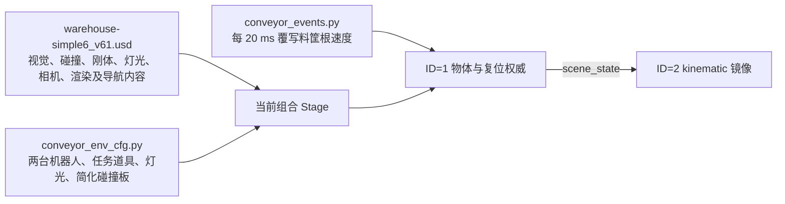

# Isaac G1 双机器人流水线场景优化路线与验收基线

> 状态：规划基线，本文不表示其中改动已经实施。
>
> 核对日期：2026-08-07。
>
> 适用任务：`Isaac-G1-29DoF-Sonic-Conveyor`。
>
> 审查基线：分支 `feat/ubuntu-f12-scene-reset`，提交 `d062fde`，Isaac Sim 5.1.0。
>
> 性能历史数据另见 [win2 conveyor 跨机闭环帧率账本](windows_conveyor_50hz_zh.md)。

本文把 2026-08-07 对当前运行画面、任务代码、USD 资产、PhysX 日志和 NVIDIA 官方资源的
只读审查整理为可逐项执行的施工路线。后续优化应在本文中记录基线、实验结果和取舍，避免
同时修改多类变量后无法判断收益来源。

## 1. 结论和当前决策

当前场景仍有明显优化空间，但第一优先级不是更换整套仓库外观，而是修正运行时场景的
物理语义、裁掉背景资产附带的非任务内容，并把流水线改成真正的接触表面驱动。

当前决策如下：

1. 保留现有输送机的主要视觉造型，不直接导入厂商高精 CAD。
2. 新建任务专用的轻量工作单元层，而不是继续直接把完整编辑场景当运行时场景。
3. 背景默认是静态视觉；只有显式注册、可复位、可同步的任务物体才能成为动态刚体。
4. 优先试用 PhysX Surface Velocity；保留旧的“覆写料筐速度”实现作为短期 A/B 回退路径。
5. 料筐、推车、纸箱等资产先解决尺寸、质量、碰撞代理和任务必要性，再考虑提升外观细节。
6. 资源统一锁定 Isaac Sim 5.1 版本并尽量本地化；不能因为采用 OpenUSD 就默认资产可以再分发。

本轮不承诺未经 A/B 验证的帧率收益，也不把 GUI FPS、物理步频和跨机闭环频率混为一谈。

## 2. 当前场景基线

### 2.1 当前组合方式



相关入口：

- 背景、碰撞板、任务道具、灯光和事件注册：
  [`conveyor_env_cfg.py`](../tasks/g1_tasks/g1_29dof_sonic_conveyor/conveyor_env_cfg.py)
- 流水线有效域和料筐速度覆写：
  [`conveyor_events.py`](../tasks/g1_tasks/g1_29dof_sonic_conveyor/conveyor_events.py)
- 两种布局的机器人、料筐和推车坐标：
  [`scene_layout.py`](../tasks/g1_tasks/g1_29dof_sonic_conveyor/scene_layout.py)
- 当前行为和已知限制：
  [`g1_29dof_sonic_conveyor/README.md`](../tasks/g1_tasks/g1_29dof_sonic_conveyor/README.md)

### 2.2 已确认事实、风险和待验证项

| 项目 | 审查事实 | 影响 | 级别 |
|---|---|---|---|
| v61 动态装饰物 | 背景根层包含 10 个 `ConveyorBelt_Box` 和 5 个 `KLT_Bin` 动态刚体；当前任务只显式锁定一个蓝色料箱 | 这些物体没有完整纳入 reset/scene-sync，host 与 viewer 可能独立模拟并分叉 | P0 |
| v61 工位平移未同步到代码 | v61 把 packing table 与 `blue_sorting_bin_01/02` 整体往 `-Y` 挪了约 0.5～0.6 m（离线 bbox 比对：bin y 从 `[14.60,16.00]` → `[13.99,15.36]`），而 `ROBOT_WORKSTATION_Y=14.148` 没跟着动 | **默认布局 `=1` 的两台机器人开局就与有碰撞的分拣料箱重叠**（robot_1 进 bin_02 约 1.8 cm、robot_2 进 bin_01 约 16 cm，料箱 z 跨 `[0.50,0.95]` 正是腰部高度）；`=0` 布局不受影响。未实跑确认弹飞/倒地复位的实际表现 | P0 |
| 动态三角网格碰撞 | 本次运行日志在启动和重载各出现一轮回退，共涉及 26 个唯一 Prim 路径 | PhysX 自动退回 convex hull，不应把该回退当成稳定的碰撞资产制作流程 | P0 |
| v61 依赖规模 | Sdf 根层 reference list-op 静态审计记录 1,806 条非空引用项、1,805 个唯一资产路径；v48 对照为 60/59 | 冷启动、换机和版本漂移风险显著增加 | P0 |
| 依赖统计口径 | 上述数字是 USD 根层直接写入的引用列表，不等于组合 Stage 的传递依赖数，也不等于一次运行实际下载数 | 后续必须分别记录“直接引用清单、传递闭包、实际缺缓存下载” | P0 |
| 输送机资产 | `ConveyorBelt02.usd` 约 46.7 MB，审查到约 230 万三角形、115 个材质、56 个启用碰撞体和 6 个刚体 | 任务又创建整块简化碰撞板，组合后可能有重复碰撞；需在 Stage 上确认 | P0 |
| 输送语义 | 当前在静止高摩擦板上每 20 ms 给料筐重写 `vx=0, vy=-speed` | 已知平均速度约 0.25 m/s，低于配置的 0.3 m/s，并有慢速自转；抓取时可能与驱动竞争 | P0 |
| 驱动有效域 | 高度条件为带面高度 `±0.15 m` 的宽容差 | 料筐已被举起约 10 cm 时仍可能处于驱动窗口 | P0 |
| 灯光 | 父场景 DomeLight、任务 Sun 与 v61 内部灯光叠加，静态审查约 20 盏 | 增加 RTX 成本，也会导致塑料材质过曝和视觉主次不清 | P1 |
| 非任务道具 | 流水线布局仍继承远离工位的 packing table、动态 cubes，并常驻推车、纸箱和 test box | 旧 A/B 已显示道具是明确成本；布局开关目前主要改坐标，没有真正卸载资产 | P1 |
| robot_2 工位 | 当前任务说明已明确其站位仍偏展示，可达性尚未闭环 | 必须通过 IK 和实际抓取回归决定站位，不能只凭画面移动 | P1 |
| 镜像机器人 | 已合并执行器组并降低 solver，但仍是完整 articulation 和高面数视觉模型 | 若只用于显示，可进一步改成无 PhysX 的 Xform/骨骼镜像并提供视觉 LOD | P1 |
| 当前现场性能 | 本次 `--full_kit --device cpu` 运行画面约 3～4 FPS，日志同时提示 CPU governor 为 `powersave` | 只能视为检查模式告警，不能拿来否定历史 45～50 Hz 闭环结果 | 测量前置 |

> `1,805` 是本次审查对当前 v61 根层的静态统计结果。实施资产治理时应把统计脚本纳入仓库，
> 在提交中保存可复现的清单和资产哈希，不能长期依赖本文中的一次性数字。

### 2.3 已有优化，不重复盲试

以下方向已有实测结论，应先阅读
[50 Hz 性能账本](windows_conveyor_50hz_zh.md)，再决定是否重试：

- 晚渲染、GUI 隔圈渲染和镜像机器人 solver/执行器合并已经实施或验证过。
- 旧 v48 场景下，镜像机器人和任务道具的成本高于 warehouse 背景本身。
- `--no_render`、单纯降分辨率、async rendering、随意调整 render interval 没有形成通用收益。
- 当前 CPU pipeline 是 scene-sync kinematic 写位姿的兼容路径，不应只为“GPU 更快”直接改 CUDA。
- 流水线事件已经避免逐步 GPU→CPU 条件同步，这部分不是当前首要瓶颈。

v61 是最近才切换的资产，因此旧 v48 的“warehouse 约等于零成本”不能直接外推到 v61；必须做
同口径 A/B。

## 3. 优化原则

1. **任务闭环优先于画面丰富度**：先保证输送、停止、抓取、复位和同步，再增加视觉细节。
2. **视觉与碰撞分层**：高质量视觉网格不直接承担动态碰撞；动态物体使用 primitive、convex 或
   compound proxy。
3. **动态实体必须显式登记**：每个动态物体都要能回答谁拥有、谁驱动、如何 reset、如何同步。
4. **几何参数单一真源**：带面尺寸、碰撞板、spawn、停止点和驱动有效域由同一份几何配置派生。
5. **一次只改一个变量**：每个阶段保留旧实现开关，暖机后使用相同参数和相同样本纪律比较。
6. **指标分层记录**：分别记录控制频率、物理/环境耗时、渲染 FPS、RSS/VRAM 和资产加载时间。
7. **版本和许可先行**：实际依赖固定为 Isaac Sim 5.1；官方资产不直接复制进公开仓库。

## 4. 分阶段施工路线

### P0：固化可复现基线

在改 USD 或物理前完成，否则后续无法证明优化收益。

实施清单：

- [ ] 记录 Git 提交、Isaac Sim/Isaac Lab 版本、GPU 驱动、硬件和启动命令。
- [ ] 记录 v61 与 `ConveyorBelt02.usd` 的哈希和直接引用清单。
- [ ] 使用 `tools/perf_mode.sh status` 检查 governor；正式测量前切到 performance。
- [ ] 固定 scene-sync、DDS、渲染和 `_PERF_AB` 参数，不在候选之间临时改启动方式。
- [ ] 每个候选至少测 3 轮；每轮暖机后丢弃前 8 个样本，再连续记录至少 3 分钟。
- [ ] 保存启动 PhysX 告警、资源加载时间、RSS、VRAM 和 `[Performance] A/E/R/S/T`。
- [ ] GUI FPS 单列，禁止用它替代 50 Hz 闭环判定。

建议记录口径：

| 指标 | 用途 | 基线门槛 |
|---|---|---|
| A/E/R/S/T 中位数和 P95 | 网络等待、环境步、渲染、同步与总周期归因 | 与现有账本使用相同定义 |
| 控制频率 | SONIC/Isaac 闭环能力 | 目标 50 Hz；`sync_waits` 不持续增长 |
| GUI FPS | 操作员画面流畅度 | 单独记录，不作为物理闭环替代指标 |
| 启动到可交互时间 | 资源依赖和缓存效果 | 区分冷缓存与热缓存 |
| RSS/VRAM | 场景和材质负担 | 同硬件、同分辨率比较 |
| PhysX/资产告警 | 资产正确性 | 候选不得新增告警 |
| 料筐轨迹 | 任务质量 | 速度、横向漂移、偏航、停止误差和静止蠕动 |

### P1：清理物理语义并生成 runtime-only 工作单元

建议新增任务专用 `conveyor_workcell_lite.usda`，先用 override/payload 方式保留原始视觉资产，
不要直接破坏 v61 源文件。稳定后再决定是否离线烘焙为独立轻量 USD。

保留内容：

- 工位附近地面、必要墙体和结构柱；
- 三段输送机的必要视觉；
- 任务要求的操作桌、护栏、安全标识和少量环境参照；
- 一套明确的灯光和任务相机；
- GroundPlane、带面、操作台等必要且简化的静态碰撞代理。

删除或关闭内容：

- 背景自带 Camera、RenderProduct、RenderSettings、NavMesh 和额外 PhysicsScene；
- 不参与任务的远处货架、成千纸箱和装饰物碰撞；
- 15 个背景动态箱/料筐的 RigidBodyAPI；若纯装饰，同时关闭 CollisionAPI；
- 输送机视觉 payload 中不需要的刚体和碰撞，避免与任务 proxy 重复；
- 背景内部灯光，只保留统一的环境光和工位灯。

动态物体处理规则：

| 类型 | 处理 |
|---|---|
| 纯背景装饰 | visual-only，无 RigidBody、无 Collision |
| 需要遮挡但不交互 | static/kinematic，使用简单 proxy，明确不参与 scene-sync |
| 任务可交互物体 | 显式 `RigidObjectCfg`，简化 collider，纳入 reset、scene-sync 和状态检查 |

验收：

- [ ] 启动日志不再出现目标背景物体的 dynamic triangle mesh → convexHull 回退。
- [ ] 组合 Stage 只有一套 PhysicsScene、任务相机和预期灯光。
- [ ] 输送机视觉与简化带面不存在重复碰撞。
- [ ] 所有动态实体都在动态实体清单中，并明确 host/viewer 所有权。
- [ ] 连续 20 次整场景 reset 后，物体数量、位姿和同步清单不漂移。
- [ ] v61 原版与 workcell-lite 使用 P0 口径完成 A/B，并保存结果。

回退：保留环境开关，例如 `ISAACLAB_CONVEYOR_BACKGROUND=legacy_v61|workcell_lite`，在轻量层完成
回归前继续默认旧背景。

#### 短期止血：先把 15 个背景动态刚体锁成 kinematic

workcell-lite 是大改；在它落地前可以先复用既有的 `lock_background_rigid_bodies` 事件止血。

🪤 **但不能只往 `BACKGROUND_LOCK_PRIM_NAMES` 里加名字。** 现有 EventTerm 写死
`parent_path="Background/ConveyorBelt"`，而这 15 个新 prim 是背景 USD 的 **`/Root` 直接
子节点**（`/Root/ConveyorBelt_Box_00`、`/Root/KLT_Bin_00`，不在 `/Root/ConveyorBelt/`
下面）。照现有 parent_path 拼出来的路径不存在，事件只会打印 `prim 不存在` 然后静默跳过。
要么给它们单开一个 `parent_path="Background"` 的 EventTerm，要么把 parent_path 改成按
prim 名全 stage 搜。

顺带记两个位置事实（离线 bbox 比对，均在带面中线 `x=-5.62` 上）：

- `ConveyorBelt_Box_00..09` 原点 `z=0.63`，**低于任务碰撞板顶面 `0.772`** ⇒ 开局就嵌在
  板里，与 `blue_sorting_bin_02` 那个已知的"开局下沉再弹飞"是同一个病；
- `KLT_Bin_00..04` 原点 `z=0.89～0.99`，在板面之上，属于自由落体落到板上；
- 两族的 y 覆盖 `11.71～18.58`，正压在 `drive_totes_on_conveyor` 推塑料筐的通路上。

### P2：把速度覆写改成接触表面驱动

推荐顺序：

1. 保留现有视觉和简化碰撞板，在碰撞面应用 `PhysxSurfaceVelocityAPI`。
2. 如果需要可视化搭建和 OmniGraph 控制，再评估 Isaac Sim 5.1 Conveyor Node。
3. 只有弯曲带、多带面交汇或同一物体同时接触不同速度带时，才评估新版 Warp 自定义摩擦方案。

建议把工作区域拆成三段，而不是让整条带只能启停：

```text
入料/输送区 -> 减速区 -> 抓取停止区
   0.30 m/s     可调渐降       0 m/s 或机械挡停
```

实现要求：

- 新增类似 `ISAACLAB_CONVEYOR_DRIVER=legacy|surface_velocity` 的 A/B 开关。
- 旧驱动只作为回退，不与 Surface Velocity 同时生效。
- 带面几何、方向、速度、spawn、停止区和回收区由统一的 `BeltGeometry`/配置对象派生。
- 不再通过宽松空间框判断“筐仍在带上”；由真实接触或明确的带面分区表达。
- 料筐离开接触后不再收到额外切向速度；抓取时不能和机器人争夺物体。
- scene-sync 仍只由 ID=1 产生物体权威状态，ID=2 不重复驱动。

建议初始验收门槛，后续可按抓取需求收紧：

| 项目 | 建议初始门槛 |
|---|---|
| 稳态输送速度 | `0.30 ± 0.015 m/s` |
| 从入料到停止的横向中心漂移 | ≤ 20 mm |
| 同一路程偏航漂移 | ≤ 5° |
| 抓取停止点误差 | ≤ 30 mm |
| 停止后 5 秒蠕动 | ≤ 5 mm |
| 举离带面 | 底面离开接触后不再受到带面驱动 |
| reset 重复性 | 20 轮无位置累积和额外物体 |

必须回归 `ISAACLAB_TOTES_ON_CONVEYOR=1` 和 `=0` 两种布局。推车布局原有完整作业闭环尚未
实跑，不能只测默认流水线布局就关闭 legacy 驱动。

### P3：道具、料筐、机器人和画面整理

#### 料筐与道具

- 当前视觉引用的是 60×40×30 cm Tote_B04，流水线布局缩放到 0.5 倍，但质量仍统一为
  0.45 kg。优先从 SimReady 资源中寻找原生目标尺寸；找不到再使用缩放资产。
- 为两个布局分别标定质量和惯量，不让体积相差 8 倍的物体保持同一动力学参数。
- 用底板加四壁的 5-box compound collider 代替开口筐 convex decomposition，并做手指插入、
  抓边和掉落回归。
- 流水线布局按需卸载 packing table、legacy cubes、推车、纸箱和 test box；不能只把它们移远。
- 纸箱和非关键道具允许休眠，逐级 A/B solver iteration，不能牺牲抓取稳定性换性能数字。

#### 双机器人和同步

- 为两台机器人分别生成抓取前、抓取中、搬运后的 IK/碰撞可达包络。
- 调整 robot_2 站位和对应停止区，使两台机器人都能在不穿带、不互撞的情况下完成抓取。
- 只有 ID=1 与任务物体发生物理交互的架构限制保持不变，除非另开方案修改权威模型。
- viewer 侧若只需要展示，评估用 Xform/UsdSkel 更新替代完整 PhysX articulation。
- 为镜像机器人提供视觉 LOD；现有高质量原型仍保留为演示 variant。
- 足底 ContactReport 只保留任务真正使用的刚体，先通过 A/B 判断是否可关闭诊断传感器。

#### 灯光、相机和视觉主次

- 默认只保留一个环境光和 2～4 个工位灯，阴影开关作为单独 A/B 变量。
- ✅ **已做**：GUI 开局机位改成站在流水线开头正对流水线，且随
  `ISAACLAB_TOTES_ON_CONVEYOR` 自适应（`max(ROBOT_WORKSTATION_Y + 4.0, 18.8)`，两种布局
  分别落在 `y=18.80` / `22.75`）。此前写死的值只适配 `=1` 布局，在 `=0` 下距作业组仅
  0.25 m 且正对拖车中心。详见任务 README「GUI 开局机位」。
  ⚠️ 后续动机位时别再写死单一坐标——两种布局的作业组差 4.6 m。
- 提供“全局监控”和“抓取近景”两个相机预设（当前只有随布局自适应的全局机位一个）。
- 清理抓取区附近推车和纸箱，重新对齐安全地贴；不要让装饰物遮挡料筐停止区。
- 可增加护栏、急停、传感器和分区标识，但默认做静态视觉或简单碰撞。

验收：

- [ ] 两台机器人均通过 IK、碰撞检查和实际抓取回归。
- [ ] 两种料筐布局的质量、惯量和碰撞代理有独立配置与测试。
- [ ] ID=1 权威、ID=2 镜像、跨机 reset、断连恢复和重连不回归。
- [ ] 全局相机能看清物流方向，近景相机不被输送机端部或道具遮挡。
- [ ] 画质候选分别记录 FPS/VRAM，不影响 P0 的控制频率判定。

### P4：资源本地化、版本锁定和部署

1. 下载并使用与运行环境匹配的 Isaac Sim 5.1 资产包，不直接接入 latest/6.x 路径。
2. 为任务生成资产清单：逻辑名称、解析后 URL、本地相对路径、文件哈希、来源版本和许可备注。
3. 任务层不再新增未登记的绝对 S3 URL；通过配置化 asset root 或 resolver 切换本地资源根。
4. 分别验证热缓存、空缓存联网和离线本地包三种启动方式。
5. 自动检查缺失相对引用，尤其当前手工提供且被 `.gitignore` 排除的 `ConveyorBelt02.usd`。
6. NVIDIA 内容遵循 Isaac Sim 附加软件和材料许可；不要把受限资产 blob 直接提交到公开仓库。

验收：

- [ ] 新机器按部署文档可解析全部必要资产，不依赖旧机器的 `~/.cache/ov`。
- [ ] 离线本地资产模式无缺失引用，并记录冷启动时间。
- [ ] 资产清单可区分直接引用、传递依赖和实际下载文件。
- [ ] Git 中只包含允许提交的任务 override、配置、生成脚本和自有资源。

## 5. 推荐资源和取舍

| 优先级 | 资源 | 用途 | 采用建议 |
|---|---|---|---|
| 1 | [Isaac Sim 5.1 Conveyor Belt Utility](https://docs.isaacsim.omniverse.nvidia.com/5.1.0/digital_twin/warehouse_logistics/ext_isaacsim_asset_gen_conveyor.html) | `Isaac/Props/Conveyors`、Belt/Roller、Track Builder、Conveyor Node | 当前首选。优先复用现有视觉，并把任务带面改为 Surface Velocity |
| 1 | [SimReady Explorer](https://docs.omniverse.nvidia.com/kit/docs/omni.simready.explorer/latest/Overview.html) | 搜索带 Physics Variant 的料筐、托盘和纸箱 | 用于寻找原生尺寸任务物体；仍需按任务重标质量、摩擦和碰撞 |
| 1 | [SimReady Containers & Shipping 01/02](https://docs.omniverse.nvidia.com/usd/latest/usd_content_samples/downloadable_packs.html) | 塑料筐、纸箱、托盘、容器 | 内容完整但单包约 20 GB；优先本地安装并只引用实际需要的资产 |
| 2 | [Warehouse Creator 5.1](https://docs.isaacsim.omniverse.nvidia.com/5.1.0/digital_twin/warehouse_logistics/ext_omni_warehouse_creator.html) | 模块化地面、墙体和仓库布局 | 适合未来频繁改布局；生成结果仍要裁成 runtime-only 层 |
| 2 | [Isaac Sim 5.1 下载与本地资产包](https://docs.isaacsim.omniverse.nvidia.com/5.1.0/installation/download.html) | 固定版本、离线加载、换机部署 | 用 5.1 对应包，不直接引用 latest 资产路径 |
| 参考 | [Isaac Sim 资产结构建议](https://docs.isaacsim.omniverse.nvidia.com/5.1.0/robot_setup/asset_structure.html) | visual/collider 分层、实例化、材质和碰撞简化 | 用于设计 workcell-lite 和重复模块 |
| 参考 | [Isaac Lab 仿真性能指南](https://isaac-sim.github.io/IsaacLab/develop/source/how-to/simulation_performance.html) | 接触、碰撞几何、CPU governor 和性能排查 | 作为 A/B 纪律和 collider 选择依据 |
| 许可 | [Isaac Sim Additional Software and Materials License](https://docs.isaacsim.omniverse.nvidia.com/5.1.0/common/license-isaac-sim-additional.html) | NVIDIA 资产使用和分发边界 | OpenUSD 是格式，不代表资产采用开源许可 |

Interroll、FlexLink、Bosch Rexroth 等厂商 CAD 只在需要一比一复刻真实设备时考虑。它们通常需要
减面、合并零件、重建碰撞和单独核对许可；对于当前控制与抓取仿真，不是更优的默认资源。

## 6. 预计涉及的代码与资产

| 路径 | 后续职责 |
|---|---|
| `tasks/g1_tasks/g1_29dof_sonic_conveyor/conveyor_env_cfg.py` | 背景 variant、统一带面配置、灯光、道具按需加载、Surface Velocity 配置 |
| `tasks/g1_tasks/g1_29dof_sonic_conveyor/conveyor_events.py` | legacy 驱动回退、驱动互斥、回收和 reset 逻辑 |
| `tasks/g1_tasks/g1_29dof_sonic_conveyor/scene_layout.py` | 从统一几何派生机器人、料筐、停止区和道具布局 |
| `tasks/g1_tasks/g1_29dof_sonic_conveyor/scene_assets/` | workcell-lite override、碰撞代理和许可允许的自有资源 |
| `tasks/g1_tasks/g1_29dof_sonic_conveyor/scene_assets/props/tote_b04_physics.usda` | 料筐质量、惯量、材质和 compound collider |
| `tests/test_conveyor_scene_layout.py` | 布局、几何边界、非法配置和参数派生测试 |
| `tools/smoke_conveyor_scene.py` | Stage lint、轨迹、停止、举离、reset 和双端同步 smoke |
| `doc/windows_conveyor_50hz_zh.md` | 保存跨机性能实测账本，不承载本路线的资产设计细节 |

建议新增自动检查：

- 禁止任务动态刚体使用 triangle mesh collider；
- 禁止背景引入第二个 PhysicsScene、非预期 Camera/RenderProduct 和重复灯光；
- 动态实体集合必须被 reset/sync 清单覆盖，或显式声明为仅本机实体；
- 任务资产的绝对远程引用数不能超过审查后的 allowlist；
- 料筐举离带面后驱动立即解除；
- 两种布局均检查速度、停止点、偏航、reset 和回收。

## 7. 推荐提交边界和回退策略

按下列顺序分别提交，避免形成无法回退的大提交：

1. **基线与 lint**：只加入测量脚本、依赖清单和自动检查，不改变场景行为。
2. **workcell-lite**：背景物理、灯光和非任务内容清理，保留 legacy v61 开关。
3. **Surface Velocity**：新驱动置于 feature flag 后，legacy 仍可选。
4. **料筐与布局**：compound collider、质量/惯量、robot_2 可达性和相机灯光。
5. **资源本地化**：5.1 资产根、清单、部署文档和离线验证。

任何候选出现以下情况应立即回退到上一阶段，而不是继续叠加调参：

- 机器人行走、Dex3 抓取或足底接触稳定性回归；
- 料筐被举起后仍受带面驱动；
- reset 后出现重复物体、位姿累积或 host/viewer 分叉；
- `sync_waits` 持续增长或跨机断连恢复失效；
- 出现新的 PhysX fallback、缺失资产或材质解析告警；
- 性能改善只来自改变了测量口径。

## 8. 每阶段结果记录模板

后续完成一项优化后，在本文末尾追加记录：

```markdown
### YYYY-MM-DD：<阶段/候选名称>

- Git 提交：
- 资产版本与哈希：
- 硬件 / OS / Isaac Sim：
- 完整启动命令：
- governor：
- scene-sync / DDS / 渲染配置：
- 暖机和采样方法：

| 指标 | 基线 | 候选 | 差值 |
|---|---:|---:|---:|
| A 中位数 / P95 | | | |
| E 中位数 / P95 | | | |
| R 中位数 / P95 | | | |
| S 中位数 / P95 | | | |
| 闭环频率 | | | |
| GUI FPS | | | |
| RSS / VRAM | | | |
| 冷启动 / 热启动 | | | |
| 料筐速度 / 横移 / 偏航 / 停止误差 | | | |

- 功能回归：默认布局 / 推车布局 / 抓取 / reset / scene-sync / 断连恢复
- 日志告警变化：
- 结论：保留 / 回退 / 继续实验
- 后续动作：
```

## 9. 总体完成清单

### 9.1 TODO：v48 → v61 换版遗留（2026-08-07 离线 USD 比对得出）

切 v61 时只改了 `usd_path` 一行，代码里那批从 v48 几何换算出来的硬编码坐标没有同步复核。
以下按修复优先级排列，前两项会让仿真跑错，不只是画面问题。

- [ ] **P0 · 15 个背景动态刚体压在流水线上**（`ConveyorBelt_Box_00..09` +
      `KLT_Bin_00..04`）。三个后果：9 个 Box 嵌在碰撞板里会被弹飞、挡住塑料筐通路、
      不在 `SYNC_OBJECT_NAMES` 里会让双机分叉。长期方案见 §P1 workcell-lite，
      短期止血与 `parent_path` 的坑见 §P1「短期止血」。
- [ ] **P0 · 默认布局 `=1` 的机器人站位落进有碰撞的分拣料箱**（见 §2.2 新增行）。
      修法二选一，需要先定：① 把 `ROBOT_WORKSTATION_Y` 跟着桌子往 `-Y` 挪约 0.6 m
      （改代码）；② 把 v61 里的桌子/料箱挪回 v48 位置（改 USD）。
      ⚠️ 与 §P3「调整 robot_2 站位」是两件事：那条是可达性优化，这条是开局就穿模。
- [ ] **P4 · `warehouse-simple6_v48.usd`（2.0 MB）已无引用但仍在仓库**，随 P4 资产
      清单一起决定删除还是标注为对照基线保留。
- [x] ~~P3 · GUI 开局机位不适配 `=0` 布局~~ —— 已改成随布局自适应，见 §P3 与任务 README。

已复核**确认不用改**的（同一轮比对，免得后来人重查）：流水线三段 `ConveyorBelt_A08_06/07/08`
的世界跨度在 v48 与 v61 中逐位相同（`x[-6.192,-5.041]`、`y[10.188,18.222]`），所以
`conveyor_collider` 的 `pos`/`size`、`CONVEYOR_Y_RECYCLE/RESPAWN/STOP` 以及带面
`y[10.19,18.22]` 的注释全部仍然成立；`blue_sorting_bin_02` 也还在、还是动态刚体，
现有 `BACKGROUND_LOCK_PRIM_NAMES` 那条依然必要且有效。

> 判据口径：以上均为 `pxr` 离线读两份 USD 的包围盒/刚体属性比对，**未启 Isaac Sim 实跑**。
> CardBox 系列引用的是绝对 S3 URL，离线拉不到 mesh，因此那几族只能确定原点与刚体属性、
> 不知道实际尺寸——"Box 原点低于板顶 0.772"是按原点算的，实际嵌入深度取决于其几何原点位置。

### 9.2 分阶段

- [ ] P0 可复现基线和依赖清单完成。
- [ ] P1 workcell-lite 完成，背景动态刚体和重复物理语义清零。
- [ ] P2 Surface Velocity 完成，两种布局的输送与抓取验收通过。
- [ ] P3 料筐、robot_2 可达性、镜像 LOD、灯光和相机完成。
- [ ] P4 Isaac Sim 5.1 资产本地化和新机离线部署完成。
- [ ] 达到 50 Hz 目标或留下同口径、可复现的剩余瓶颈账本。
