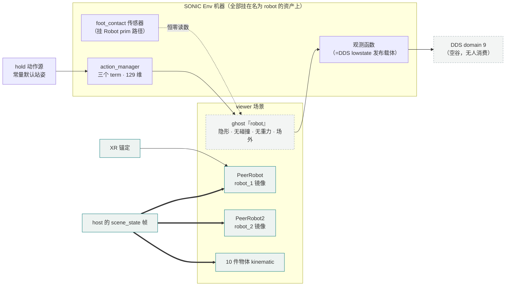

# 流水线双机器人 host + viewer 架构（工作包 A/B 实录）

> 里程碑（2026-08-02）：**一台 Ubuntu 同进程跑 robot_1+robot_2 双全动力学 SONIC 机器人，
> 各由一套 GR00T deploy 独立控制（键盘可分别驱动行走），win2 上的纯镜像 viewer 实时同步
> 全场景**——"1 host + N viewer"目标架构首次实景运行。
> 配套 GR00T 仓库提交：话题前缀参数化 + deploy.sh 环境优先修复（分支 feat/isaac-state-sync）。

## 1. 三种身份模式

conveyor 任务（`Isaac-G1-29DoF-Sonic-Conveyor`）现在有三种身份，全部由
`sync_identity.py` **单一真源**解析（sim_main 与 conveyor_env_cfg 共用同一份实现，
进程环境变量永远优先于 `configs/scene_sync.env`）：

| 身份 | 环境变量 | 场景 | ZMQ 方向 |
|---|---|---|---|
| 对等端 | `ISAACLAB_LOCAL_ROBOT_ID=1/2` | 本机全动力学 robot + 对端镜像体 | 双向（机器人互发；物体/复位 ID=1 权威） |
| viewer | `ISAACLAB_LOCAL_ROBOT_ID=0` | 双镜像体 + 场外 ghost + kinematic 物体 | 只收不发（SUB host:15555） |
| **host** | `ID=1` + `ISAACLAB_HOST_BOTH_ROBOTS=1` + `ISAACLAB_SONIC_ROBOT_COUNT=2` | **robot_1+robot_2 双全动力学**，无镜像体 | 只发不收（robot_1+robot_2+物体） |

host 的第二机器人通过**第二套 DDS 通道**驱动：话题 `rt/r2/lowcmd|lowstate|secondary_imu`
与 `rt/r2/dex3/*`、DDS 注册名 `g129_r2`/`dex3_r2`、共享内存 `isaac_robot_state_r2` 等。
⚠️ **shm 名必须隔离**——SharedMemoryManager 对同名段是静默 attach 共享，漏改后缀的
症状是两台机器人互相执行对方命令且无任何报错。

### 1.1 viewer 的 ghost 机器人——是什么、为什么、边界在哪

**ghost 只存在于 viewer 模式**（Ubuntu host 与对等模式里没有它）。它是 viewer 场景中
名为 `robot` 的**隐形占位机器人**，对画面与同步语义零贡献——存在的唯一理由是：
SONIC 任务的整套 Env 机器硬挂在名为 `robot` 的资产上，删掉它要重做一套
"无机器人 EnvCfg"（actions/observations/terminations 全家裁剪 + sim_main 分支），
而留一个退化占位体只花约百行身份层代码。这是工作包 A 的取舍决定。



读图要点：**左半是 ghost 的全部职责**（给 action_manager 一个 129 维落点、给观测/DDS
发布链一个数据源、给 foot_contact 一个初始化对象——全是"喂机器"，输出进空谷）；
**右半才是 viewer 的真实语义**（镜像体吃 host 帧、XR 锚定挂镜像体）。两半互不相连。

ghost 的退化配置（`_make_local_robot_cfg` 的 VIEWER_MODE 分支）：
- 复用无碰撞镜像 USD（无重力/零阻尼/执行器合并单组/solver 1/1，物理开销 ~1ms 级）；
- `activate_contact_sensors=True`（否则 foot_contact 在 gym.make 时 RuntimeError——踩过）；
- `spawn.visible=False`（否则 AR 自由视角能看到第三台机器人——踩过）；
- 停场外 `(0,-30)`，hold 动作源钉在默认站姿（无锁步，主循环满频的关键）。

三种身份下 `robot` 资产的真身对照：

| 身份 | `robot` 是什么 | 场景机器人总数 |
|---|---|---|
| host（Ubuntu） | **robot_1 真身**（全动力学，deploy#1 控制） | 2 台真身 |
| viewer（win 侧） | **ghost**（隐形占位） | ghost + 2 镜像体 |
| 对等模式（基线） | 本机真身 | 真身 + 1 镜像体 |

⚠️ 与 ghost 相关的两个已修坑（§5.1 之外的补充）：XR 锚定默认指向 `Robot` prim
（即 ghost）且 **teleop 设备持有 xr_cfg 的拷贝**——重定向必须把 self.xr 与每个
teleop 设备的 xr_cfg 一起改，只改一处会出现"日志说挂了镜像体、头显却锚在 ghost"
的割裂现象。将来若做 viewer 专用 EnvCfg（无 robot 版），ghost 可整体消除
（半天级重构，当前 50Hz 满帧无紧迫性）。

## 2. 启动手册（Ubuntu host + 双 deploy + win 侧 viewer）

```bash
# ① host sim（GUI 验证形态；无画面跑法去掉 --hide_ui 换 --no_render，省 ~10ms/帧）
GR00T_WBC_ROOT=<GR00T仓库> \
UNITREE_DDS_DOMAIN=1 UNITREE_DDS_INTERFACE=lo \
ISAACLAB_LOCAL_ROBOT_ID=1 ISAACLAB_HOST_BOTH_ROBOTS=1 \
ISAACLAB_SONIC_ROBOT_COUNT=2 \
UNITREE_SKIP_LOWSTATE_CRC=1 UNITREE_LOWCMD_CRC_SAMPLE_INTERVAL=50 \
python sim_main.py --task Isaac-G1-29DoF-Sonic-Conveyor --robot_type g129 \
  --action_source sonic_dds --device cpu --hide_ui --stats_interval 10

# ② 两套 deploy —— ⚠️ 必须并行启动（错峰 ~20s 即可），不能串行等 Init Done：
#    双 ack AND 门下 deploy#1 的 Init 要看到新鲜物理样本，而物理推进又在等
#    deploy#2 的 ack——串行启动会自锁在 4Hz。
cd $GR00T_WBC_ROOT/gear_sonic_deploy
bash deploy.sh --disable-crc-check --input-type keyboard isaac                      # 终端A
G1_LOCAL_ROBOT_ID=2 bash deploy.sh --disable-crc-check --input-type keyboard isaac  # 终端B

# ③ win 侧 viewer（win2 桌面双击，参数见 run_pipeline_viewer.bat）：
#    ISAACLAB_LOCAL_ROBOT_ID=0 + ISAACLAB_SONIC_ROBOT_COUNT=2
#    + ISAACLAB_SCENE_SYNC_PEER_IP=<Ubuntu IP>
```

- 测前清残余：`pgrep -fa g1_deploy_onnx_ref` 必须为 0——残留实例会以 kHz 级频率
  轰 ack，链路数据完全不可信（本轮实测 12 个残留 = 2kHz lowcmd）。
- 首次双实例并发冷启动会争写 planner 的 `.trt` 缓存，先单跑一次预热。

## 3. 键盘控制（两台各自独立）

每台机器人的 deploy 都是完整键盘协议，激活序列：**`]`（开始控制）→ 回车（开 planner）→
`2`（选行走模式）→ 移动键**。移动是脉冲语义（一发走一段自动停回 IDLE）。

| 键 | 动作 | 键 | 动作 |
|---|---|---|---|
| `w`/`s` | 前进/后退 | `a`/`d` | 左移/右移 |
| `j`/`l` | 左转/右转 | `9`/`0` | 减速/加速 |
| `1`-`8` | 动作模式集 | `` ` `` | 急停 |

实测（2026-08-02，多轮）：robot_1/robot_2 单发脉冲行程可达 10-16m，SONIC 自平衡
全程稳定，win2 viewer/AR 同步无丢帧；robot_1 的 180° yaw 出生朝向下行走正常（此前
"需 Phase 1 实测"的悬案就此关闭）。

操作要领（实测标定）：
- **起步有 ~10s 的慢加速斜坡**（前几秒 <0.01m/s 的挪动是动量爬升，不是没响应——
  别在这个窗口重复排障或猛按键）；随后进入 ~0.25m/s 巡航直到脉冲行程走完自动停；
- planner 激活（回车→`2`）在 deploy 进程存续期内保持，不需要每次移动前重按；
  `host_bringup` 类编排脚本可在发车后直接预激活两台（发 `\n` 与 `2` 进键管道）；
- 键盘走管道文件时：`printf 's' >> <keyfile>`，单字符即时生效无需换行。

## 4. 帧率账本（host 双机器人，i9/20 核 Linux）

| 阶段 | 主循环 | 关键数字 |
|---|---|---|
| 贯通初始（全 CRC） | 25-26 Hz | E 20-42ms 波动，A 有 20ms 尖峰 |
| + LowState 发布免 CRC | 26-29 Hz | A 尖峰消失 |
| + lowcmd 接收 1/50 抽样 | 31-33 Hz | E 收敛 ~19ms |
| + renice -10 | **34-36 Hz** | headless 形态 |
| GUI（--hide_ui） | 24-26 Hz | R≈10ms 渲染成本 |

归因（py-spy 150Hz）：瓶颈是 **GIL 单线程天花板**（20 核只用 1.2 核，sim 101.5%）。
- ⚠️ **Linux 上 unitree CRC 也是纯 Python**（旧账本"C 库 ~0.01ms"不成立）——双通道
  1000 包/秒下发布 CRC 20.5% + 接收校验 14.5%，两刀 CRC 是最大收益；
- ⭐ **执行器逐子步记账仅 5.6%**——win2 上 39% 的头号嫌疑在 Linux 不成立，
  主机器人执行器合并这条红线刀**不需要动**；
- 剩余：native PhysX ~40%（双 43DoF 固有）、cyclonedds 反序列化 ~10%
  （500Hz lowcmd 九成是重发包，深水区）、观测/metrics 小项 ~5%。

锁步语义下 35Hz = 0.7× 慢放（不丢帧不失真）；viewer 侧渲染恒 50fps。

## 5. 已知坑（每条都实测踩过）

1. **身份双源裂脑**：sim_main 与 env cfg 曾各自解析身份——已收敛进 `sync_identity.py`，
   新增身份判定一律走它，别在任何一侧重新实现。
2. **deploy.sh 的 env 文件强覆盖**（GR00T 侧已修）：`config/g1_udp_network.env` 里的
   `G1_LOCAL_ROBOT_ID=1` 曾无条件覆盖命令行身份，第二实例静默变第一实例。
3. **双 deploy 串行启动自锁**、**残留 deploy 污染**（见 §2）。
4. deploy C++ 的话题常量是 namespace 级 static、**先于 main() 初始化**——
   `SONIC_DDS_TOPIC_PREFIX` 只能走环境变量，改成 CLI 参数会静默失效。
5. 观测函数缓存必须按 asset 键控——共用 buffer 是 aliasing 覆写、共用 sample_seq
   会让双锁步 tick 串台（ack 永不匹配），都是排查代价极高的静默错误。
6. ⛔ **deploy planner 的"退化态"**（2026-08-02 实锤 + 双 agent 日志/源码对照定因）：
   WALK→IDLE 之后（整场景 reset 是最强诱因，但**不限于 reset**）再次下发 WALK 时，
   planner 从残留内部状态 replanning——判别指纹是 **Planner Model 推理耗时从健康的
   93-182ms 掉到 36-79ms（约 1/3）**，生成的轨迹退化为站立或原地踉跄（tilt 冲 7.7°
   无位移）。`t`/`r`/回车重开 planner 均救不回（重开会新增"Reset init reference"
   绑定行，但 Model 耗时不回升——残留在更深的轨迹续接状态里）。
   **唯一已验证恢复路径 = 重启 deploy（按测量纪律 = 全链路重启）**。
   GR00T 侧修法方向：IDLE→WALK 转换时重置 planner 的 motion buffer/heading 续接
   （gen_frame_/current_frame_ 逻辑，见 localmotion_kplanner 与 CurrentFrameAdvancement）。
   运维约束：行走演示期间不要发整场景 reset；归位优先用 `w` 走回。
   ⚠️ **判据勘误**：`cmd_max_abs_dq≡0` 不能当"没发运动目标"的证据——本 deploy 的
   lowcmd 无条件 tau_ff=0/dq_target=0（纯位置目标+kp/kd 是设计）。正确判据：
   host 侧 `root_speed_max`（行走 ≈1.2m/s vs 退化 ≤0.008）与 `pd_target_max`
   （行走 1.33-1.50rad vs 站立 ≈0.39），deploy 侧 Planner Model 耗时（>90ms 健康）。

## 6. 新机器部署 viewer（如 win1）——相对通用 Windows 部署的增量

基础环境先按 `doc/windows_deployment_zh.md`（及知识库《新Windows机器从零部署任务书》）
走通用部署：conda `env_isaaclab`(py3.11) + isaacsim 5.1.0 + IsaacLab fork(`0703` 分支) +
**cyclonedds 自编 0.10.x**（千万别 11.x）+ Windows 长路径。在此之上：

**viewer 可以豁免的**（比对等/host 端轻很多）：
- ❌ GR00T deploy 二进制与模型（viewer 无锁步、不跑推理）——但 ⚠️ `groot_assets` 子集
  （win2 上 137M）**仍然必需**：`import tasks` 在模块级合成 SONIC URDF，与跑哪个任务无关；
- ❌ 防火墙入站规则（viewer 只有**出站** SUB 连 host:15555，无入站需求）；
- ❌ deploy 侧的一切（`--disable-crc-check` 等都是 host 侧的事）。

**viewer 必需的**：
- 工程 checkout `feat/pipeline-host-viewer`（或 tag `pipeline-dual-robot-walking-v1`），
  镜像机器人 USD 已随 git 入库（`scene_assets/peer_robot/`，约 85MB，无需构建）；
- `pyzmq`（env_isaaclab 内 pip 装）；
- 环境变量：`PIPELINE_HOST_IP=<Ubuntu IP>`（bat 里可覆盖，win2 默认已探测）；
- **AR 额外**：`isaacsim-extscache-{kit,kit-sdk,physics}` 三包（装前先开长路径，
  半装残渣会让 h5py DLL 崩掉普通仿真）+ SteamVR（NOLO Link 或 ALVR 拉起）。

**启动与判据**：桌面双击 `run_pipeline_viewer.bat`（无 AR）。AR 按操作者分脚本：
操作者 #1 的机器双击 `run_pipeline_viewer_ar.bat`（视角跟 robot_1），操作者 #2 的机器
双击 `run_pipeline_viewer_ar_robot2.bat`（视角跟 robot_2）——都不能 ssh 起。判通看日志四行：`Pure-mirror viewer mode`、`本机身份: viewer`、
（AR）`viewer XR 锚定挂镜像体 PeerRobot`、启动后无持续 `Stream stale`。
多台 viewer 无需 host 感知——PUB 天然扇出，第 N 台只管 SUB 上来。

## 7. 遗留与下一步

- 🎯 **Pico VR 控制接入**（正路，keyboard 只是调试工具）：POSE 全身跟随已实测通过
  （2026-08-03，tag `pipeline-pico-pose-v1`），见 §8。
  ⚠️ 早先"VR 链不经过键盘 planner ⇒ §5.6 退化 bug 不在此路径"的说法**只对
  POSE（全身流）子模式成立**：PLANNER 子模式（摇杆行走）走的是与 keyboard 完全
  相同的 kplanner 线程与 movement_state_buffer，bug 同样在环，且 planner 话题
  1s 超时自动回 IDLE 会频繁制造 IDLE→WALK 转换（正是退化触发指纹）；
- ⛔ **keyboard planner 退化态**（§5.6，降级为调试工具限制）：修复方向已定位
  （IDLE→WALK 轨迹续接重置），因正路是 VR 控制、不优先修；调试期按运维约束绕行；
- AR 视角锚定的头显实测（代码已落地挂 PeerRobot/PeerRobot2，pxr 验证过 USD 层级；
  头显侧确认视角位置/pelvis yaw 跟随/B 键 recenter 待做）；
- win1 部署（照 §6 增量指引）与**多 viewer 并发**实测（传输层天然扇出，未实测）；
- host 50Hz：cyclonedds 反序列化去重（重发包先比 raw bytes 再解？需下探 SDK 层）、
  观测/metrics 小项打包、native 部分无大油水；当前 headless 34-36Hz / GUI 24-26Hz；
- AR viewer 实测 50Hz 满帧（A 0.0/E 6.9/R 10.6）——物理留 host、画面全推 viewer 的
  架构红利已被数字证实。

## 8. Pico VR 控制接入（工作包 Pico-①：单 Pico → deploy#1，✅POSE 全身跟随已实测）

> 从零部署的施工顺序/操作手册/判读表在 `doc/pipeline_pico_vr_deployment_zh.md`，
> 本节只放架构盘点结论与设计取舍。

状态（2026-08-03，tag `pipeline-pico-pose-v1`）：头显实测**发车 + POSE 全身跟随
跟动已通**（操作者动、robot_1 跟着动）；摇杆行走（PLANNER）与急停语义⏳待补测。
前置：GR00T 必须 ≥ `6783bb8`——分支同步提交 14f8bf1 误删的 666 个 gear_sonic
文件（teleop 模块/SMPL 数据/G1 资产）已全量恢复，旧检出跑 POSE 必崩。
双 Pico 编排 `PIPELINE_DUAL_PICO=1`（63901/63902 → 5556/5566）：
**✅2026-08-04 双操作者各控一台实机验证通过**，细节以 Pico 任务书 §5 为准。

拓扑（`tools/pipeline_pico_bringup.sh` 一键拉起）：

```
Pico 4 Ultra: GameLink(com.Nolo.CloudVR)
  └─ 全身追踪+手柄按键/摇杆 JSON → UDP 192.168.50.68:63901
       （XrLinkConfig.json 的 wholeBodyTracking 节点，已指向本机、sendControllers=true）
pico_manager_thread_server.py --manager --no_auto_pose --port 5556
  （GR00T 仓库 .venv_teleop，XROBO_TRANSPORT=udp，不需要 XRoboToolkit PC Service）
  └─ ZMQ PUB :5556，三话题 pose / command / planner（同端口靠前缀区分）
deploy#1 --input-type zmq_manager（其余不变，isaac profile）
  └─ DDS rt/* 锁步 ↔ host sim（Isaac 侧零改动——输入侧换血不动 deploy↔Isaac 段）
```

盘点结论（改双机 VR 前必读）：

- **输入端口不随 robot id 分流**：`G1_LOCAL_ROBOT_ID=2` 只改输出侧（5567/g1_2_debug/
  rt/r2），ZMQ 输入恒默认 localhost:5556，且 command/planner 话题名硬编码——
  双实例必须 `--zmq-port` 显式分开（如 #2 用 5566），或两 manager 分居两机用 `--zmq-host`。
- **manager 状态机**（`--no_auto_pose` 下）：OFF --A+B+X+Y--> PLANNER（摇杆行走：
  左摇杆方向/右摇杆转向，A+B 升档 X+Y 降档）；A+X 切 POSE（全身跟随，进入瞬间的
  身体姿态=校准零位）；左摇杆按下切 VR_3PT；再按 A+B+X+Y=急停（manager 退出）。
  command 有 1Hz keepalive，slow-joiner/deploy 重启都能追上。
  ⚠️ 默认 auto_pose 会在头显数据一到就直接进 POSE 全身跟随——bring-up 一律 `--no_auto_pose`。
- **发车语义变化**：channel#1 不再靠 stdin `']'`，而是 manager 进任意控制模式时发
  command(start=True) → deploy 置 0xa1 → sim 日志 `[sonic_dds] CONTROL marker received`。
  未发车期间 deploy 照常回 ack，锁步/物理不受影响（站姿保持）。
- **feedback 通道现状为断**：manager 的 FeedbackReader 订 5557/`g1_debug`，而 deploy#1
  实际输出是 UDP 且话题 `g1_1_debug`（ZMQ 前缀匹配也对不上）⇒ PLANNER_FROZEN 抓不到
  上身目标、VR_3PT 重校准回退零位（有 WARNING）。step① 的 PLANNER/POSE 不依赖它；
  要接通得给 deploy#1 加 `--output-type zmq --zmq-out-topic g1_debug`（待验）。
- **reset 已知风险**（step③ 要单独验的）：Isaac epoch reset 只清 deploy 的 policy
  历史/heading 并断 ack，**不通知输入接口、不清 planner_state/manager 缓冲**——
  PLANNER 子模式下与 keyboard 同风险（§5.6），POSE 流子模式 reset 后续流错位是否被
  lag-rebase 吸收未实测。
- 验收判据：manager 日志 `entering ... mode` + sim 侧 channel#1 `CONTROL marker
  received` + 摇杆推动时 robot_1 行走且 viewer 端同步。
