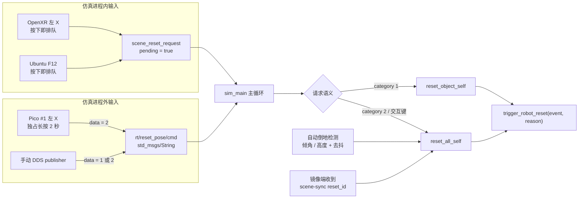
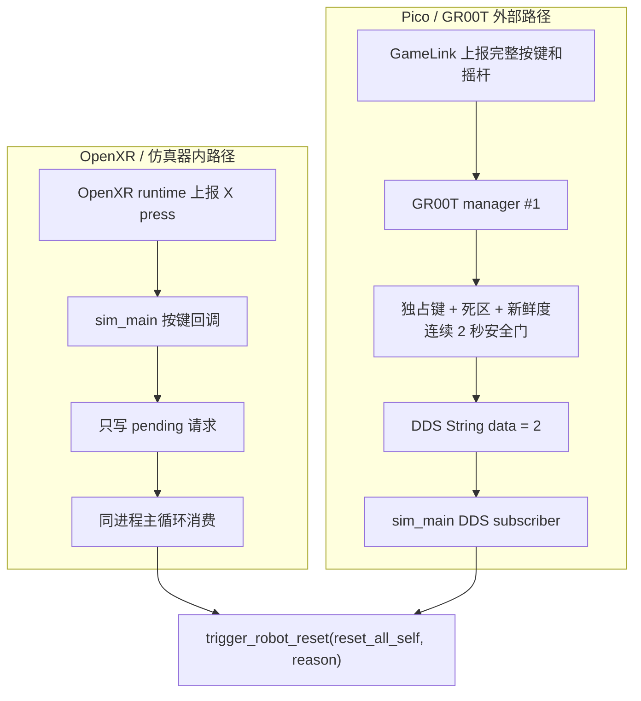
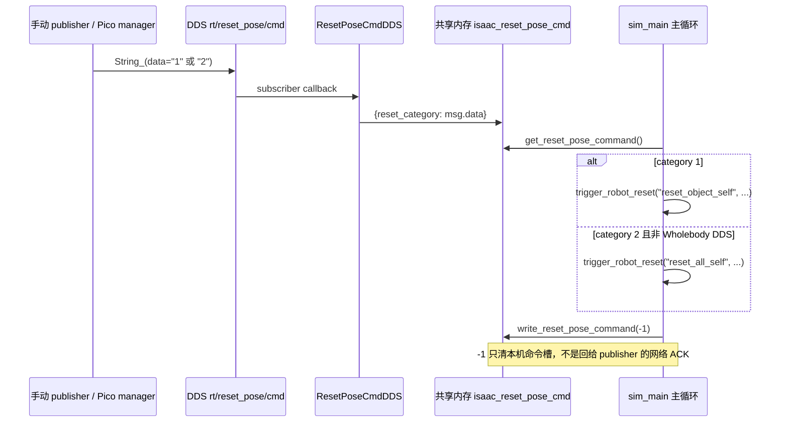
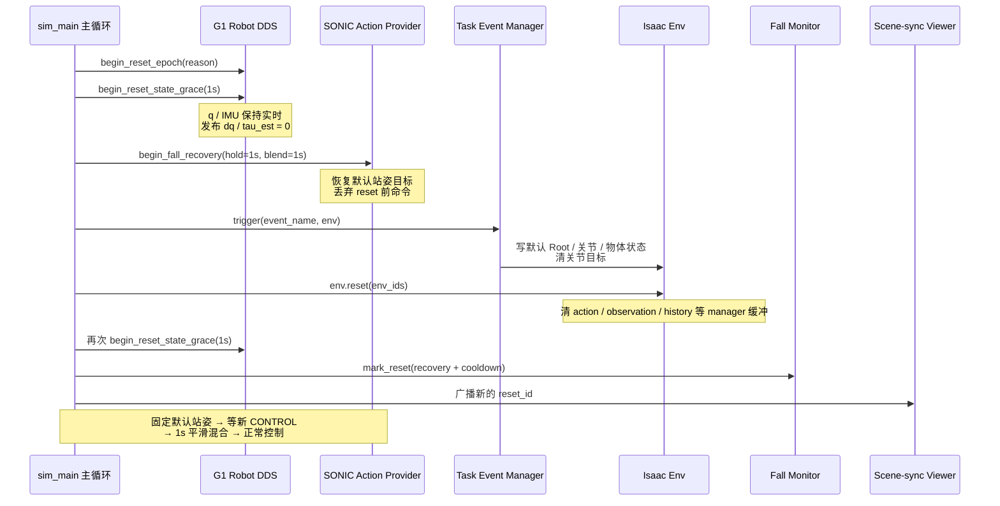

# Isaac/SONIC 场景复位机制：OpenXR、Pico、DDS 与安全恢复事务

本文从输入到物理场景完整解释 `Isaac-G1-29DoF-Sonic*` 的 reset：OpenXR 手柄左 X、
Pico 左 X 长按、Ubuntu F12、手动 DDS 命令和自动倒地检测有什么区别，
`trigger_robot_reset()` 又如何把一次“瞬移回出生点”变成可安全恢复 SONIC 控制的事务。

正式知识库副本位于
`~/Documents/robotics-knowledge-base/NVIDIA/IsaacLab/unitree/SONIC场景复位机制-OpenXR-PICO-DDS与安全恢复事务.md`。

## 0. 先说结论

> **上游入口不同，底层恢复事务相同。** OpenXR 左 X 是仿真进程内的单击请求；Pico 左 X
> 是 GR00T manager 验证独占长按 2 秒后发布的 DDS category 2；“手动 DDS reset 命令”
> 就是人为向同一个 DDS topic 发布 `String_.data = "1"` 或 `"2"`。在当前 SONIC pipeline
> 中，整场景请求最终统一调用 `trigger_robot_reset("reset_all_self", reason)`。

“直接触发”只表示**按键侧没有 2 秒长按安全门**，不表示在 OpenXR/Kit 回调里直接执行
`env.reset()`。OpenXR 和 F12 回调都只把请求排队，真正复位仍在仿真主循环中执行。

## 1. 所有入口如何汇合



| 入口 | 在哪里识别 | 触发条件 | 进入主循环的方式 | 是否依赖 GR00T 改动 |
|---|---|---|---|---|
| OpenXR/仿真器左 X | `sim_main.py` 的 OpenXR device | 单次按下 | 进程内 `pending` 队列 | 否 |
| Ubuntu F12 | 本地 Isaac/Kit 窗口 | 聚焦窗口后单次按下 | 进程内 `pending` 队列 | 否 |
| Pico #1 左 X | GR00T manager #1 | 独占长按 2 秒且输入新鲜 | DDS category 2 | 是 |
| 手动 DDS 命令 | 任意同 DDS domain 的 publisher | 主动发布 category 1/2 | DDS subscriber + 共享内存 | 否 |
| 自动倒地检测 | Ubuntu `sim_main.py` | Root 倾角/高度持续越界 | 主循环直接调用 | 否 |
| 远端场景同步 | 镜像 viewer | 收到新的 reset id | 主循环直接调用 | 否；属于跟随，不是人工入口 |

Conveyor 双机器人 host 中，任意一台确认倒地、F12、OpenXR 或 Pico #1 发出整场景请求，
都会复位两台机器人和场景动态物体，并向镜像 viewer 广播新的 reset id。

## 2. OpenXR 左 X 与 Pico 左 X 的本质区别

这两个功能可能都叫“左 X 复位”，但监听位置、输入安全门和传输路径完全不同。



| 对比项 | OpenXR/仿真器左 X | Pico #1 左 X 长按 |
|---|---|---|
| 按键由谁读取 | Isaac/Isaac Lab 的 OpenXR device | GR00T 的 GameLink/XrClient + manager |
| 手势 | 按下沿直接受理 | 必须独占连续长按 2 秒 |
| 防误触 | 仅交互请求冷却，默认 2 秒 | A/B/Y 排他、四轴死区、样本新鲜度、断流 fail-closed、松开后重武装 |
| 传输 | 仿真进程内置位，不经过 DDS | 跨进程发布 `rt/reset_pose/cmd = "2"` |
| 启用条件 | 创建 OpenXR device：`--teleop_device motion_controllers` | manager #1 显式带 `--enable_isaac_scene_reset` |
| 左 X 是否要额外指定 | 不需要；`--xr_reset_button` 默认就是 `left/x` | 不靠 `--xr_reset_button`，由 GR00T 参数控制 |
| 权限边界 | 当前仿真进程 | 双 Pico 中仅 manager #1 有全局 reset publisher |
| 最终场景语义 | 整场景 | category 2，在当前 SONIC pipeline 中为整场景 |

因此，“手柄 X 键以前就有，只是加参数才能使能”要分两条回答：

- **OpenXR 路径**：绑定代码已经在仿真仓库中；只要用
  `--teleop_device motion_controllers` 创建 OpenXR device，默认就绑定左 X，通常无需再写
  `--xr_reset_button left/x`。传 `--xr_reset_button none` 才会关闭；老版 Isaac Lab fallback
  更是写死左 X，且忽略改键参数。
- **Pico/GR00T 路径**：独占长按状态机和 DDS publisher 是另一套实现，默认关闭；manager #1
  必须显式加 `--enable_isaac_scene_reset`。

如果同一运行形态同时能收到 OpenXR 按键、又开启 Pico manager 的 DDS reset，一次长按可能先在
按下沿触发 OpenXR reset，2 秒后再触发 DDS reset。现场应只选一条手柄权威路径。

## 3. “手动 DDS reset 命令”到底是什么

它不是 shell 内建命令，也不是 Isaac Sim 控制台指令，而是一条普通 DDS 消息：

| 字段 | 值 |
|---|---|
| Topic | `rt/reset_pose/cmd` |
| DDS 类型 | `unitree_sdk2py.idl.std_msgs.msg.dds_.String_` |
| Payload | `String_.data = "1"` 或 `"2"`，注意是字符串 |
| Subscriber | `dds/reset_pose_dds.py` 中的 `ResetPoseCmdDDS` |
| 消费位置 | `sim_main.py` 主循环 |

数据流如下：



### 3.1 Category 的准确语义

| `enable_wholebody_dds` | category | `sim_main.py` 分派的事件名 |
|---|---:|---|
| `false`，当前 SONIC 默认 | `"1"` | `reset_object_self` |
| `false`，当前 SONIC 默认 | `"2"` | `reset_all_self` |
| `true`，旧 Wholebody 路径 | `"1"` 或 `"2"` | 都分派到 `reset_object_self` |

这里有一层容易忽略的间接关系：category 只决定**事件名**，真正写回哪些实体由当前任务给该
事件名注册的 handler 决定。普通 PickPlace 任务的 `reset_object_self` 往往只重置物体；当前
SONIC 基类则把 `reset_object_self` 和 `reset_all_self` 都注册到
`reset_scene_to_default(..., reset_joint_targets=True)`，所以二者实际都会恢复整场景。

Pico 仍固定发送 category 2，是为了明确表达“全局复位”，不依赖当前任务碰巧把两个事件名
注册成同一个 handler。

### 3.2 如何手工发一条 category 2

下面是一次性诊断命令。domain 和 interface 必须与正在运行的仿真一致；当前 SONIC 本机默认
是 domain 1、interface `lo`。执行它会立即改变运行中的仿真场景：

```bash
UNITREE_DDS_DOMAIN=1 UNITREE_DDS_INTERFACE=lo python - <<'PY'
import os
import time

from unitree_sdk2py.core.channel import ChannelFactoryInitialize, ChannelPublisher
from unitree_sdk2py.idl.std_msgs.msg.dds_ import String_

domain = int(os.environ["UNITREE_DDS_DOMAIN"])
interface = os.environ.get("UNITREE_DDS_INTERFACE")
ChannelFactoryInitialize(domain, interface) if interface else ChannelFactoryInitialize(domain)
publisher = ChannelPublisher("rt/reset_pose/cmd", String_)
publisher.Init()
time.sleep(0.2)
publisher.Write(String_(data="2"))
time.sleep(0.2)
print("published rt/reset_pose/cmd category=2")
PY
```

仓库中的 `reset_pose_test.py` 也是这个原理，但当前脚本写死 `ChannelFactoryInitialize(1)`，并且
只发送 `[1]`，所以它默认测试的是 category 1，不是 category 2。

### 3.3 它不是什么

- 不是让 deploy 自己“站起来”的命令；复位权威在 Isaac 端。
- 不是 `env.reset()` 的远程 RPC；DDS 消息先落共享内存，再由主循环解释。
- 没有请求 ID，也没有发布端可见 ACK；本地写回 `-1` 仅防止同一命令反复消费。
- topic 名虽然叫 `reset_pose`，当前 SONIC category 2 的效果远大于“改一个 pose”。

## 4. `trigger_robot_reset()` 如何实现安全复位

### 4.1 主事务时序



### 4.2 每一步解决什么问题

1. **推进 reset epoch**

   `begin_reset_epoch()` 把 32 位 epoch 加一，并通过 LowState 的保留字段带给 deploy。
   单个 `tick` 只能标识连续物理样本，epoch 才能标识“状态发生了不连续跳变”。锁步接下来要求
   LowCmd 同时确认最新 tick 和最新 epoch，reset 前的 ACK 不能混进 reset 后。

2. **在瞬移前打开 LowState grace**

   复位会把关节从当前位置瞬间写回默认位置。PhysX 在这个边界附近算出的 `dq` 不代表真实电机
   速度，却可能超过 deploy 的 `abs(dq) > 35 rad/s` 安全阈值。grace 期间位置和 IMU 仍实时，
   只有发布出去的 `dq`、`tau_est` 临时为零。

3. **重置动作提供者，而不只重置物理**

   `begin_fall_recovery()` 记录复位开始时间，恢复默认站姿 command，清最后有效命令时间和指标
   窗口。reset 前收到的 LowCmd/HandCmd 即使还留在共享内存中，也会因时间戳不新鲜而被拒绝。

4. **先触发任务事件，再调用 `env.reset()`**

   两者不是重复操作：任务事件负责把 Root、关节、动态物体和关节目标写回任务定义的默认状态；
   `env.reset(env_ids=...)` 负责清理 Isaac Lab 的 action、observation、history 等运行时缓冲，并把
   新状态推进到下一控制周期。只做前者会留下旧控制历史，只做后者又未必执行本任务自定义的
   场景恢复语义。

5. **复位后重新打开 grace**

   `env.reset()` 在 CPU 忙时可能比前一个 1 秒窗口还慢。函数返回后再次开启 grace，保证最容易
   出现 teleport-derived `dq` 的首批 PhysX 样本一定被覆盖，而不是依赖复位耗时碰运气。

6. **冷却、广播并安全交还控制权**

   倒地 monitor 清候选并进入“恢复时长 + cooldown”的禁止重触发窗口；双机 host 广播新
   `reset_id`，镜像端丢弃旧代次场景帧。动作提供者先保持默认站姿，随后只接受 reset 后新到达、
   epoch/tick 匹配且带 CONTROL marker 的命令，再在默认 1 秒内从站姿平滑插值到 SONIC 目标。

### 4.3 为什么双机器人要操作两套 DDS

Conveyor host 同时查找 `g129` 和 `g129_r2`，两套都推进 epoch、开启 grace。若只处理其中一套，
另一台 deploy 会把场景复位造成的关节跳变误认为真实高速运动，可能单独触发 35 rad/s 安全限。

### 4.4 非 SONIC 路径的降级行为

若 `sonic_reset_supported` 为 false，函数只触发任务事件并广播 scene-sync reset，不执行 epoch、
LowState grace、action-provider recovery 和 `env.reset()` 这一整套 SONIC 安全事务。该分支最后
返回 `False` 表示“没有走 SONIC 安全恢复路径”，不代表任务事件没有执行。

### 4.5 复位时间线


完整倒地恢复参数和历史故障注入结果见
[SONIC 29DoF 阶段交接文档](sonic_g1_29dof_phase1_handoff_zh.md#81-终端-a启动-43dof-载体上的-29dof-sonic-闭环)。

## 5. 自动倒地复位

自动检测默认只在有 SONIC DDS action provider 的权威仿真端启用；纯镜像 viewer 不启用。
只有对应控制通道已经进入 CONTROL 后才开始监控，避免初始化站姿固定阶段误判。

默认判据为以下任一条件连续保持 `0.5s`：

- Root 倾角 `>= 60°`；
- Root 高度 `base_z <= 0.35m`；
- Root 位姿出现 NaN、Inf 或无法计算的姿态。

双机器人 host 对两台机器人分别监控，任意一台确认倒地都会触发同一个整场景 reset。

可调参数：

```text
--fall_reset_tilt_deg 60
--fall_reset_min_base_height 0.35
--fall_reset_debounce_seconds 0.5
--fall_reset_hold_seconds 1.0
--fall_reset_blend_seconds 1.0
--fall_reset_lowstate_grace_seconds 1.0
--fall_reset_cooldown_seconds 2.0
```

测试 `kneel`、`crawl`、`IDLE_LYING_FACE_DOWN` 等故意低姿态动作时应增加：

```text
--no_auto_reset_on_fall
```

关闭自动检测不会关闭 F12、DDS 或其他手动 reset 入口。

## 6. Ubuntu F12

F12 只使用 Isaac 仓库，不需要 GR00T 或 Pico。启用条件为：

- Ubuntu/Linux 权威端；
- 有本地、非 headless 的 Kit 窗口；
- 不是 `--no_render`、replay 或 scene-sync viewer；
- 按键前先把焦点切到 Isaac/Kit 窗口。

`--hide_ui` 可以使用，只要本地 Kit 窗口仍存在。纯 SSH 的 headless / `--no_render`
没有本地键盘事件，不能使用 F12。

按键回调只把请求放入队列，不会在 Kit render 消息泵中直接执行 `env.reset()`；主循环
随后复用原有安全 reset 路径。正常日志为：

```text
[keyboard] Isaac/Kit window shortcut: F12 = full scene reset
[keyboard] F12 pressed: full scene reset queued
[reset_input] Ubuntu keyboard F12: full scene reset
```

连续 F12/交互请求受默认 `2s` 冷却约束。当前精简实现没有把 DDS category 2 与 F12
做跨来源冷却合并，因此不要同时按 F12 和 Pico X，否则可能连续执行两次 reset。

## 7. Pico #1 左 X

控制链为：

```text
Pico GameLink
  -> GR00T XrClient（完整按键、四轴、真实收包时间）
  -> GR00T manager#1（X 长按安全门）
  -> DDS rt/reset_pose/cmd，String_.data = "2"
  -> Ubuntu sim_main.py
  -> trigger_robot_reset("reset_all_self", ...)
```

manager#1 必须使用 `--enable_isaac_scene_reset` 显式启用；默认关闭。双 Pico 时只有
manager#1 有全局 reset publisher，manager#2 刻意无权限。单 Pico manager 可以作为唯一
权威端启用。

DDS category 2 的“整场景”含义以当前 SONIC pipeline（`enable_wholebody_dds=false`）为
前提，不能直接推广到所有旧 Wholebody 任务。Isaac 消费后会把本地 reset 命令槽写回
`-1`；这不是 manager 可见的网络 ACK。

一次有效长按必须同时满足：

- 只按左 X，A/B/Y 全部未按；
- 左右摇杆四轴都在默认死区 `±0.15` 内；
- GameLink 输入样本年龄不超过默认 `0.5s`；
- 连续保持 `2s`。

触发后只发布一次，必须收到明确、有效的 X 松开帧才重新武装。缺字段、NaN/Inf、摇杆未
回中、样本过期、未来时间或 GameLink 断流都会 fail-closed；断流不能伪装成松开。
`A+X`、`X+Y` 和 `A+B+X+Y` 不会误触发 reset，四键急停仍按原始按键状态工作。

manager#1 手工启动时至少需要：

```bash
UNITREE_DDS_DOMAIN=1 \
UNITREE_DDS_INTERFACE=lo \
XROBO_TRANSPORT=udp \
XROBO_UDP_PORT=63901 \
.venv_teleop/bin/python gear_sonic/scripts/pico_manager_thread_server.py \
  --manager \
  --no_auto_pose \
  --enable_isaac_scene_reset \
  --port 5556
```

成功初始化和触发时会看到：

```text
[SceneReset] DDS publisher ready: topic=rt/reset_pose/cmd domain=1 interface=lo
[SceneReset] published full-scene reset: topic=rt/reset_pose/cmd category=2
```

manager#2 的启动命令不得包含 `--enable_isaac_scene_reset`。

## 8. 分支与仓库边界

- Isaac `feat/ubuntu-f12-scene-reset`：F12-only；不要求 GR00T 改动；
- Isaac `feat/pico-x-scene-reset`：包含同一套 F12 功能，并增加 manager#1/manager#2
  的 bringup 权限接线；
- GR00T `feat/pico-x-scene-reset`：包含 X 长按状态机、GameLink 新鲜度快照和 DDS
  publisher；
- `backup/pico-scene-reset-controls-combined-20260805`：早期合并版本，仅用于回退和
  对照，不应作为精简 F12 基线。

本地分支可能因其他场景工作继续前移；需要复现时应同时核对提交图和实际 diff，不能只看
分支名。切换到 Pico X 版本后必须重启 sim 和 manager，运行中的 Python 进程不会热加载。

## 9. 已知风险与排查

整场景 reset 会清理 Isaac 环境和本地 action provider 状态，但**不会清空外部
manager/planner 输入缓冲**。PLANNER 模式 reset 后若出现原地踉跄或不位移：

1. 查看 deploy 的 `Planner Model` 耗时；
2. 健康路径通常 `>90ms`，已知退化指纹约为 `36–79ms`；
3. 重启对应 deploy；必要时同时重启对应 manager。

重要行走演示期间不要把整场景 reset 当作无风险归位键。

常见无效原因：

| 现象 | 优先检查 |
|---|---|
| F12 无日志 | 是否聚焦 Kit；是否 headless/`--no_render`/replay/viewer；sim 是否已重启 |
| X 长按无日志 | GR00T 是否切到 X 分支；manager#1 是否带 enable 参数；DDS domain/interface 是否一致 |
| X 计时中断 | A/B/Y、四轴死区、GameLink 样本新鲜度和 UDP 连通性 |
| manager#2 长按无效 | 预期行为；manager#2 没有全局 reset 权限 |
| reset 后不能正常行走 | 检查 planner 退化指纹并重启 deploy |

## 10. 源码索引

| 机制 | 源码入口 |
|---|---|
| OpenXR/F12 只排队、主循环消费 | [`sim_main.py`](../sim_main.py) 的 `scene_reset_request`、`bind_xr_reset_button()` 和主循环 reset block |
| DDS reset subscriber | [`dds/reset_pose_dds.py`](../dds/reset_pose_dds.py) |
| 手动 DDS category 分派 | [`sim_main.py`](../sim_main.py) 中 `get_reset_pose_command()` 消费逻辑 |
| 统一 SONIC 复位事务 | [`sim_main.py`](../sim_main.py) 中 `trigger_robot_reset()` |
| reset epoch 与 LowState grace | [`dds/g1_robot_dds.py`](../dds/g1_robot_dds.py) 中 `begin_reset_epoch()`、`begin_reset_state_grace()` |
| 站姿固定、旧命令拒绝和平滑恢复 | [`action_provider/action_provider_sonic_dds.py`](../action_provider/action_provider_sonic_dds.py) 中 `begin_fall_recovery()` |
| SONIC 任务的 reset 事件注册 | [`tasks/g1_tasks/g1_29dof_dex3_sonic/g1_29dof_dex3_sonic_env_cfg.py`](../tasks/g1_tasks/g1_29dof_dex3_sonic/g1_29dof_dex3_sonic_env_cfg.py) |
| 手动 category 1 publisher 示例 | [`reset_pose_test.py`](../reset_pose_test.py) |

## 11. 已完成验证

- Isaac F12 与 bringup 权限测试：当前分支全套 `37/37` 通过；
- GR00T scene reset 与 UDP freshness 测试：`13/13` 通过；
- Python 编译、`bash -n tools/pipeline_pico_bringup.sh` 和两仓 `git diff --check` 通过；
- DDS category 2 在隔离 domain/loopback 上完成回环验证。

静态测试不能代替 Kit GUI 和真实 Pico 实机测试；实机验收时应保存上述触发日志。
